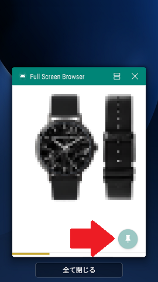

# Full Screen Browser

## For KIOSK android device.

"Settings" > "Security" > "Screen lock" > "None"

"Settings" > "Security" > "Screen pinning" > On

## customize

FullscreenActivity.java / onCreate()

webView.loadUrl( "https://remix.asia/" );

or local storage

webView.loadUrl( "file:///storage/emulated/0/Download/index.html" );

must "Settings" > "Applications" > this app > "Permissions" > "Storage" > ok
